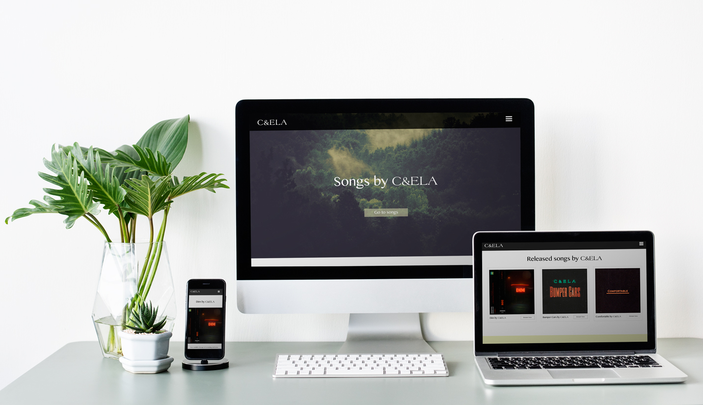
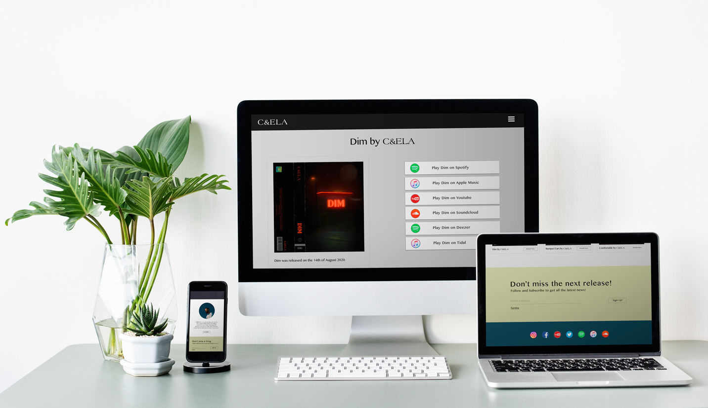
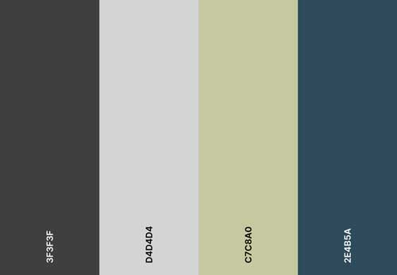
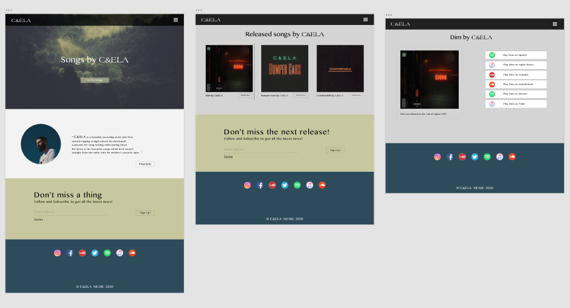
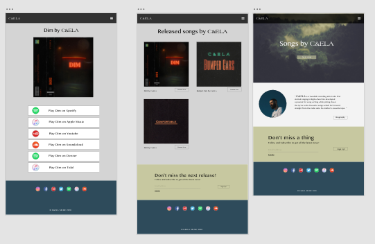
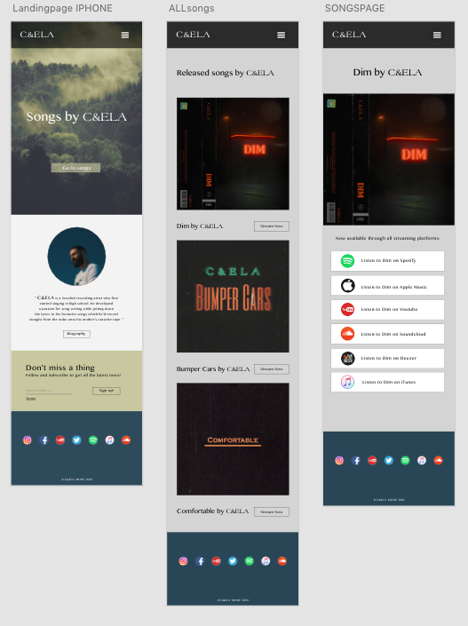

<h1 align="center">C&ELA</h1>
<h1 align="center"></h1>
<h1 align="center"></h1>


 <a href="https://dadevfa.github.io/Milestone1">Live website</a>

  <a href="https://github.com/dadevfa/Milestone1">GitHub Repository</a>

## About

This website is created to be a blend of the traditional artist/band website, and a
linktree platform that will send the artists fans and listeners to the streaming service 
they currently use. Alot of musicans outsource this link functionality outside their
sites, which is a bad way of building or maintaining their brands, and it makes 
the road for the listener/users a bit longer, since they now have to click more, and wait for a another, 
less beautiful site to load, before being able to choose prefered streaming service.


## Table of contents: 
* [General](#general)
* [Technologies](#technologies)
* [UX](#ux)
* [Design](#design)
* [Testing](#testing)
* [Deployment](#deployment)
* [Credits](#credits)

# General
This project is a simple website for an artist with the main focus on driving traffic
to music streaming services where their songs or albums are availabe.


# Technologies

## Languages: 

* HTML5
* CSS3
* Javascript

## Programs, Frameworks & Libraries:

* Adobe Xd - Create Wireframe & design the website.
* Adobe Photoshop - Crop images & logo. 
* Git - Version Control & track changes in code.
* GitHub - Host all files and publishes live site. 
* Gitpod - Code enviroment, allows code to pe pushed to Github.
* Google Fonts - Is used as pre-fall back fonts.
* Bootstrap v4.1.3 - For responsive layout, pop-up & collapse functions.
* jquery - Used for navigation bar and collapse elements.
* popper.js - Used for navigation bar and collapse elements.
* Font Awesome - Complements the design.  


# UX

### User Experience

## As a new visitor who comes straight from any social media profile of the artist and has not heard any music yet:

1. I want to know how I can quickly go to whats most important, the music. 

2. I want to understand the layout and reason for the sites functions without having to focus too much.

3. I want to be able hear a sample of any song before I commit to move my attention to another platform to stream the full song, where I most likely will find even more of the artist.

## As a visitor who comes straight from a campaign for a specific song: 

1. I want to be able to see that I landed on the right place, that specific songs page.

2. I want to understand the layout and reason for the sites functions without having to focus too much.

3. I want to be able to find my streaming platform, to play the song from there. 

## As a visitor who really likes the artist: 

1. I want to be able to connect with the artist. 

2. I want to be able to read something about the artist. 

3. I would like to be able to get a notification from the artist when there is something new going on. 


# Design 

Because it's an artist website, the design had to be slightly personal for the artist. 
Main goal for the look and feeling of the website, was to be easy, light yet special and most of all, 
something that wouldn't feel like a corporate website.

### Fonts: 

For the text that mentions artist name:
```
* Main font: Americana STD 

* Pre fallback font: Lateef (Google Fonts)

* Fallback font: Serif
```

For all other text:
```
* Main font: Lao 

* Pre fallback font: Baskervville (Google Fonts)

* Fallback font: Sans-serif
```

### Colors: 
<h1 align="center"></h1>


### Mockups

Layout, wireframes and design was made and created all in one in Adobe Xd. 
The pictures above are the same as these. The live site has the same design, however there is more functionality and details in the live site.
The functionality will grow in the future. 

Desktop:
<h1 align="center"></h1>

Tablet:
<h1 align="center"></h1>

Phone:
<h1 align="center"></h1>


## Pages: 

### Homepage:
- Homepage has a big full screen image, with a call to action button, to 
the core of the site: the Songspage. 

- Navigation bar sits ontop of the image, 
which gives a more expensive or artistic
feeling since you see through due to the set opacity. 

- Short biography directly under the hero image, should be visible from start, 
but not fully. Users focus should be on go to songs button, 
but should also know that there is more underneath.
The short bio has a button that takes user to biography.

- Underneath the short bio on homepage, there is a form that gathers 
email addresses of the users that wants to receive news and notifications 
from the artist. Personal pop-up message shows up once button is pressed. 

- Footer contains the artists most prioritized social media and 
streaming platform links. The hover functionality on them makes the site more alive
and gives the feeling of playfulness. 


### Songspage:

- Contains all the artists songs, with boxes around them. Lovely hover function that 
adds pleasing responsiveness. 
Ones user chooses song, the hover functionality remains on the box in
the new songpage. 

- Fanletter form under all the songs.


### Songpage:
- Contains same songbox as previous page, with a new preview button.
All streaming platforms that has the song is availabe under or to the right depending on the users device.
A back to Songspage button, if the user wants to check other songs out.

### Biography:
- This page is for users who wants to read about the artist,
 and get to know him better. After this, there is a button 
 taking them to Songspage.

### Contact: 

- A simple contact form, that filters the incoming messages by sorting out 
what the subject is about.

### Overall:
- Navigation bar is the same, except on the Homepage, 
since the hero image is still visible underneath it. It also contains the hamburger constantly. 
It makes the design less corporate, and more discrete, allowing focus to be on Songspage, even on desktop. 

- Footer is same through out the website.

- All buttons have similar design with hover functionality to make them 
stand out from their environment.  


## Future features: 
- Be able to upload a song with all the details and links, so that a page is created, 
and automatically shows up on Songspage. 

# Testing 

## Tests on live version:

### Navigation Bar: 
- When logo is clicked, user gets sent to home page, this works on all pages, all devices.
- All links in hamburger meny works, on all pages, on mobile, tablet and desktop devices.
- Hamburger meny is visible on all screen sizes.  
- Correct link is highlighted when user is at that specific page. Works on all pages. 

### Footer:
- All social links are correct and opens a new tab on all devices, on all pages. 
- Hover effect works fine, when mouse hovers, only on desktops. All pages and all devices. 
- Footer is always located at the bottom, on all devices, on all pages. 

### Home: 
- Hero image is always located at the very top and under the navigation bar, on all devices. 
- Call to action button, sends user to songs page. Hover effect works.
- Mini biography section changes layout correctly depending on device. 
- Biography button on startpage takes user to biography page. Hover effect works. 
- Fanmail section looks and responds well. Popup shows up, when user clicks Sign up button. 
Terms collapse works on all devices. Signup buttons hover effect works fine. 
- Signup button is not yet active to recieve any email addresses. 
### Songs:
- Page is responsive. Grid system works fine, showing each song in its own box. Pressing on the box or the stream button, takes 
user to correct song. Hover effect on the box works, and hover effect on stream button works.
- Fanmail section works as expected. Collapses terms correctly, hover effect on sign up button works. 
### Dim:
- Responsiveness is good on all devices. All links go to correct stores, in new tabs. Hover effect works fine on departure links. Preview button, collapses the preview of the song from Spotify correctly in the box, and disappears when pressed again. However the hover effect remains.
Works on all devices. Go to songs button takes user back to songs page. Hover works. Popup shows up when clicked. 

### Bumper Cars:
- Responsiveness is also good, looks and behaves exactly as mentioned above. All departure links work correctly.  

### Comfortable:
- Responsiveness works here too, link and preview goes only to Soundcloud. Go to songs page button works as expected. 

### Biography:
- Short biography text on the new artist, with a small profile picture above. Works on all devices.
When go to songs button is clicked, user goes to songs page. Hover effect works. 

### Contact: 
- Small contact form. Looks good on all devices. 
Works only if email address is entered. Not active at the moment. 

### Other:

- No broken links found. 
- All images work fine. 


### Devices:

* iPhone 5 SE 
* iPhone 6 
* iPhone 7 
* iPhone X 
* Samsung Galaxy 9 
* Macbook Pro 
* iPad 

Browsers:

* Chrome
* Safari 
* Firefox 


### HTML Validation Results: 
<a href="https://validator.w3.org/nu/?showsource=yes&doc=https%3A%2F%2Fdadevfa.github.io%2FMilestone1%2Findex.html">Homepage: Pass</a>

<a href="https://validator.w3.org/nu/?showsource=yes&doc=https%3A%2F%2Fdadevfa.github.io%2FMilestone1%2Fsongs.html">Songspage: Pass</a>

<a href="https://validator.w3.org/nu/?showsource=yes&doc=https%3A%2F%2Fdadevfa.github.io%2FMilestone1%2Fbumpercars.html">Songpage: Pass</a>

<a href="https://validator.w3.org/nu/?showsource=yes&doc=https%3A%2F%2Fdadevfa.github.io%2FMilestone1%2Fbiography.html">Biography: Pass</a>

<a href="https://validator.w3.org/nu/?showsource=yes&doc=https%3A%2F%2Fdadevfa.github.io%2FMilestone1%2Fcontact.html">Contact: Pass</a>


### CSS Validation Results: 
<a href="https://validator.w3.org/nu/#l906c1">CSS - Pass</a>

## Known issues: 
- When trying to submit the email address, even if it's not fully correct or meets requirements, the popup message still shows up.
It should only show up if email is filled in correctly. 

- Contact form is not active at the moment. 

- The jumbotron heading is not 100% where it could be, on all devices, landscape mode. There must be a better approach. Works for now. 

## Tested by other people: 

Friends, family and artist like the design. They understand the purpose of the page imidiately, and can go to places they want to go to easily. 
All buttons work, all images work, text may deviate from main style depending on device or browser, but the pre fallback fonts 
do a good job keeping the integrity of the design. 


# Deployment

This website was published using GitHub Pages. 

On Github, and on the specific repository for this page, there is a settings button.
Further down on that page is Github Pages section. 
I selected the Master branch instead of None and saved it. Site went live.
The link was made using the repository name as a part of it. 


# Credits
* Ian Lunn for great hover effects: https://github.com/IanLunn/Hover 

* My mentor 

* Stackoverflow people for inspiring to better solutions.

* Coolors.co for making it easy to print out a color palette of the colors used for this site.

* C&ELA for supplying with images, text and all other necessary things.  

